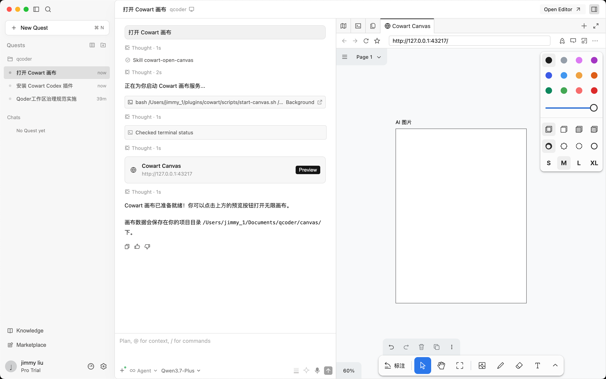
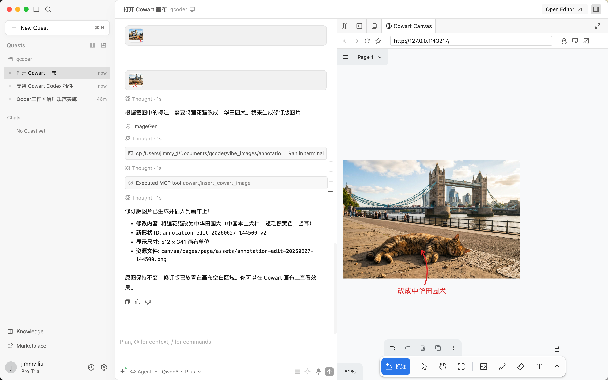
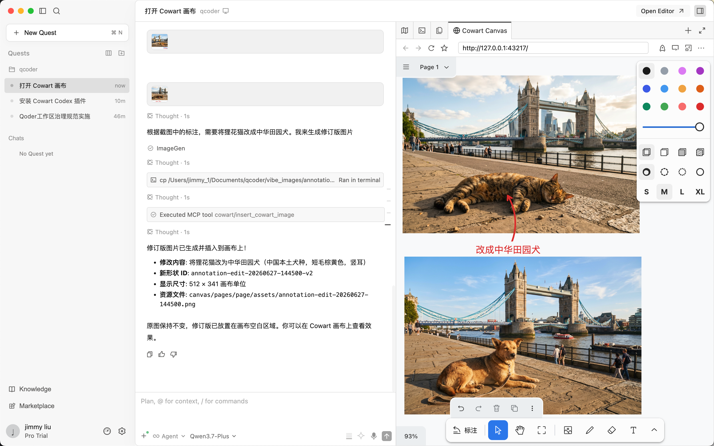

# Cowart for Qoder

一键安装 [Cowart](https://github.com/zhongerxin/cowart) 无限画布插件到 [Qoder](https://qoder.com)。

Cowart 是一个基于 tldraw 的本地无限画布，用于 AI 图片生成、标注迭代和视觉构思。

## 前提条件

- **macOS / Linux / Windows (Git Bash)**
- Node.js >= 18
- Git
- Qoder 已安装

## 一键安装

```bash
curl -fsSL https://raw.githubusercontent.com/ljm2002cn/cowart-qoder/main/install-qoder.sh | bash
```

或手动 clone 后运行：

```bash
git clone https://github.com/ljm2002cn/cowart-qoder.git
cd cowart-qoder
bash install-qoder.sh
```

## 安装内容

脚本会自动完成以下步骤：

| 步骤 | 说明 |
|------|------|
| Clone 仓库 | `~/plugins/cowart`（Cowart 画布源码） |
| 安装依赖 | `npm install` |
| 构建前端 | `npm run build` |
| 配置 MCP | 写入 Qoder 的 `mcp.json`，注册 Cowart MCP server |
| 安装 Skills | 3 个 Qoder skill 到 `~/.qoder/skills/` |
| 验证 | 逐项检查安装结果 |

脚本会自动检测操作系统（macOS / Linux / Windows），设置正确的配置路径。

## 安装后的 Skills

| Skill | 用途 |
|-------|------|
| `cowart-open-canvas` | 打开本地无限画布 |
| `cowart-image-gen` | 生成 AI 图片并插入画布 |
| `cowart-image-edit` | 根据标注截图生成修订图 |

## MCP 工具

| 工具 | 说明 |
|------|------|
| `get_cowart_selection` | 读取画布当前选中状态 |
| `insert_cowart_image` | 将图片插入画布指定位置 |

## 使用方式

安装完成后，重启 Qoder（或开启新对话），然后说：

- **"打开 Cowart 画布"** — 启动画布服务

 

- **"生成一张图片到画布上"** — AI 图片生成


  
- **"根据这个标注截图修改图片"** — 标注驱动的图片编辑




## 自定义安装路径

默认安装到 `~/plugins/cowart`，可通过环境变量修改：

```bash
COWART_DIR=/custom/path/cowart bash install-qoder.sh
```

## 各平台 mcp.json 路径

| 系统 | 路径 |
|------|------|
| macOS | `~/Library/Application Support/Qoder/SharedClientCache/mcp.json` |
| Linux | `~/.config/Qoder/SharedClientCache/mcp.json` |
| Windows | `%APPDATA%/Qoder/SharedClientCache/mcp.json` |

## 致谢

- [Cowart](https://github.com/zhongerxin/cowart) by ZHONG XIN — 画布引擎与 MCP server
- [tldraw](https://github.com/tldraw/tldraw) — 无限画布底层实现
